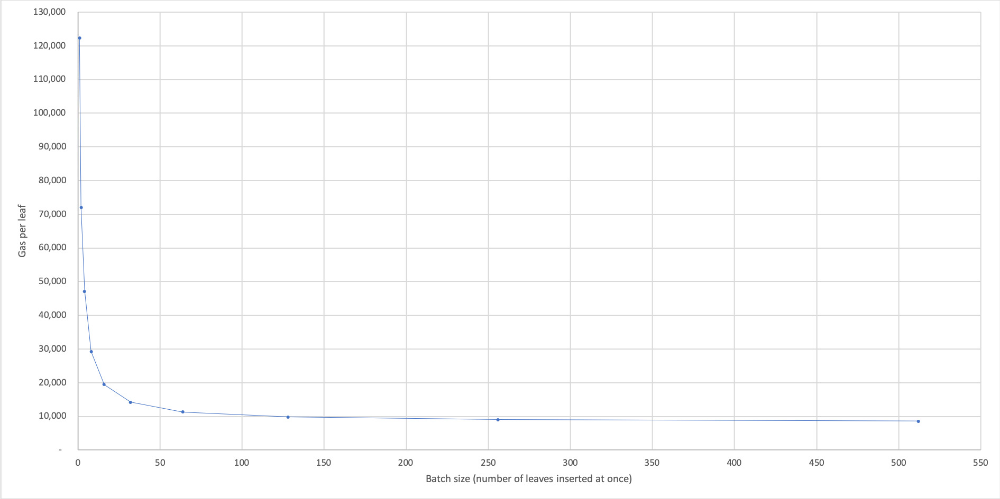

# timber :evergreen_tree:

Construct a Merkle Tree database from Ethereum logs.

---
## Contents

-   Objectives
-   Summary
-   In this repo...
-   Quick Start
-   API
-   Gas Costs
-   Technical Details

---

## Objectives
1)   Keep track of a Merkle Tree's root on-chain;
2)   Minimise the gas cost of adding leaves to the Tree;
3)   Minimise the gas cost of updating the root;
4)   Ensure data availability;

---

## Summary

Leaves are submitted to a `MerkleTree` smart-contract by users. Submitting multiple leaves in-bulk results in considerable gas cost savings per leaf.

Only the `root` and a small `frontier` of nodes is stored on-chain. New leaves are not stored on-chain; they're emitted as events.

A local merkle-tree database (off-chain) is populated with the leaves and nodes of the Tree, based on `newLeaf` events emitted by the smart-contract.

The database can then be queried, e.g. for sibling-paths in order to provide set-membership proofs to the smart-contract.

---

## In this repo...

```
./docker-compose.yml <-- 'startup' configuration
|
./merkle-tree/ <-- the 'main' microservice of this repo
      |
      contracts/ <-- example MerkleTree.sol contract for efficient merkle-tree updates
      |
      src/
          |
          db/ <-- database services for managing the merkle-tree mongodb
          |
          routes/ <-- API routes for externally accessing this microservice
          |
          filter-controller.js <-- Ethereum event filter
          |
          merkle-tree-controller.js <-- merkle-tree update & calculation controller
|
./deployer/ <-- example 'stub' microservice, demonstrating how one would use
                'timber' as part of an application
```

---

## Quick Start:

### Prerequisites

The merkle-tree miscroservice requires the following software to run:

-   Docker
-   Node.js (tested with node 10.15.3) with npm and node-gyp.
-   Xcode Command line tools:
    -   If running macOS, install Xcode then run `xcode-select --install` to install command line tools.

### Installing

Clone the merkle-tree repository and use a terminal to enter the directory.

### Starting

Start Docker:  

-   On Mac, open Docker.app.

If you have pulled new changes from the repo, then first run:  

```sh
docker-compose build
```
Start all microservices:  

```sh
docker-compose up
```

It's up and running!

### Using

#### Example usage:

##### Add leaves to the tree:

Submit loads of leaves to the `MerkleTree.sol` smart contract. We can do this easily in another terminal window:  
`docker-compose run --rm deployer npx mocha --exit --require @babel/register 'test/MerkleTreeController.test.js'` will submit many leaves.


Interact with the merkle-tree microservice through its API. A postman collection (for local testing) is provided at [./merkle-tree/test/postman-collections/](merkle-tree/test/postman-collections/).

##### Start the event filter:

Send a `post` request to `http://localhost:8000/start` to start the merkle-tree's event filters for `newLeaf` and `newLeaves` events. Any 'new leaf' events will be picked up by the filters, and cause the new leaf data to be inserted into the mongodb.

##### Update the merkle-tree database:

Send a `patch` request to `http://localhost:8000/update`. Given the leaves now stored in the mongodb, this `update` command will calculate all of the intermediate nodes from the leaves to the root, and store all of these nodes in the mongodb.

##### Get information from the merkle-tree database:

Send a `get` request to `http://localhost:8000/siblingPath/3`. This will retrieve from the mongodb the sibling-path for the leaf with `leafIndex = 3`.


### Stopping

If you want to close the application, make sure to stop containers and remove containers, networks, volumes, and images which were created by `up`, using

```sh
docker-compose down -v
```

### Testing

See the [deployment README](deployer/test/README.md) for unit tests.


---

## API

The `merkle-tree` container (or 'service') exposes several useful endpoints.

If the microservices are started with the default `./docker-compose.yml` file, these endpoints can be accessed by other containers on the same docker network through <http://merkle-tree:80>.

To access the `merkle-tree` service from your local machine (which is not in the docker network), use <http://localhost:8000> by default.

A postman collection (for local testing) is provided at [./merkle-tree/test/postman-collections/](merkle-tree/test/postman-collections/).

See `./merkle-tree/src/routes` for all api routes.

---

## Gas Costs

The following gives gas cost measurements for inserting leaves into the MerkleTree.sol contract.

### `insertLeaf`
-   `treeHeight = 32`
-   32 sha256() hashes. We use assembly to minimise the cost of calling the sha256 precompiled contract.
-   1,024 leaves inserted, one-at-a-time, from left to right.
-   Notice how there is a jump in cost every `2**n` leaves, when a new level of the `frontier` is written to for the first time.
-   The very first transaction costs the most, due to initialising of the `leafCount` and `latestRoot` parameters.
-   Gas values shown include the 21KGas transaction cost.


### `insertLeaves`

-   `treeHeight = 32`  

-   We explore the cost of inserting leaves in batches of varying sizes (doubling the batch size each time).
-   We insert each batch into an empty tree each time.
-   Gas values shown include the 21KGas transaction cost each time.
-   The Gas cost per leaf reduces asymptotically with batch size.
-   Batches of 128 leaves and over appear to start levelling out around 10,000 gas per leaf.




-   We also explore the cost of inserting a fixed total of 512 leaves, but in batches of varying sizes (doubling the batch size each time).
-   I.e.:
    -   512 transactions of batches of 1 leaf
    -   256 transactions of batches of 2 leaves
    -   64 transactions of batches of 4 leaves
    ...
    -   1 transaction of a batch of 512 leaves
-   We begin each set of transactions with an empty tree each time.
-   Gas values shown have been adjusted to exclude the 21KGas transaction cost each time. This helps hone in on the 'internal contract' gas costs, but massively understates the costs of multiple transactions of small batches (e.g. we're understating the cost of '512 transactions of batches of 1' by over 10MGas).
-   The gas cost for inserting a given number of leaves reduces asymptotically as batch size increases.
-   Beyond batches of 128 leaves, the gas savings begin to level out.


---

## Technical Details:

### On-chain  

The leaves of the tree are not stored on-chain, they're emitted as events.

The intermediate-nodes of the tree (between the leaves and the root) are not stored on-chain.

Only a 'frontier' is stored on-chain (see the detailed explanation below).  

### Off-chain  

We filter the blockchain for `newLeaf` event emissions, which contain:

```
newLeafEvent: {
  leafIndex: 1234,
  leafValue: '0xacb5678',
  root: '0xdef9012'
}
```

We then insert each leaf into a local mongodb database.  

With this database, we can reconstruct the entire merkle tree.

### Technical details


We consistently use the following indexing throughout the codebase:

```
Level Row                            nodeIndices                      frontier indices
  4    0                                  0                                  [4,
                           /                             \
  3    1                  1                               2                   3,
                   /             \                 /             \
  2    2          3               4               5               6           2,
               /     \         /      \        /      \        /      \
  1    3      7       8       9       10      11      12      13      14      1,
             /  \    /  \    /  \    /  \    /  \    /  \    /  \    /  \
  0    4    15  16  17  18  19  20  21  22  23  24  25  26  27  28  29  30    0]

leafIndices: 0   1   2   3   4   5   6   7   8   9  10  11  12  13  14  15

```

#### On-chain logic

We start with an empty `frontier = [ , , , , ]`.  

The frontier will represent the right-most fixed nodeValues at each level of the tree. So `frontier[0]` will be the right-most fixed nodeValue at level `0`, and so on up the tree. By 'fixed nodeValue', we mean that the `nodeValue` will never again change; it is permanently fixed regardless of future leaf appends.

A user submits the 0th leaf (`leafIndex = 0`) to the `MerkleTree` smart contract.

We add it to `leafIndex = 0` (`nodeIndex = 15`) in the contract's local stack (but not to persistent storage, because we can more cheaply emit this leaf's data as an event).

Let's provide a visualisation:

```
// Inserting a leaf with nodeValue = '15.0' into the tree

                                nodeValues                                frontier
                                    0                                     [    ,
                  /                                    \          
                 0                                      0                      ,
         /               \                   /               \       
        0                 0                 0                 0                ,
     /      \          /      \          /      \          /      \       
    0        0        0        0        0        0        0        0           ,
  /   \    /   \    /   \    /   \    /   \    /   \    /   \    /   \       
15.0   0  0     0  0     0  0     0  0     0  0     0  0     0  0     0        ]

  0    1  2     3  4     5  6     7  8     9 10    11 12    13 14    15 <-- leafIndices

```

We use the unusual notation `15.0` to mean "the `nodeValue` from the 0th update of nodeIndex `15`".

We now need to hash up the merkle tree to update the root. In order to do this, we need the `nodeValues` of the sibling-path of `leafIndex = 0`.

The 0th leaf is an easy case where the sibling-path nodes are always to the right of the leaf's path:

```
// Showing the sibling-path of leafIndex = 0

                                nodeValues                                frontier
                                    0                                     [    ,
                  /                                    \          
                 0                                     *0*                     ,
         /               \                   /               \       
        0                *0*                0                 0                ,
     /      \          /      \          /      \          /      \       
    0       *0*       0        0        0        0        0        0           ,
  /   \    /   \    /   \    /   \    /   \    /   \    /   \    /   \       
15.0  *0* 0     0  0     0  0     0  0     0  0     0  0     0  0     0        ]

  0    1  2     3  4     5  6     7  8     9 10    11 12    13 14    15 <-- leafIndices

*0* = "sibling-path nodeValue"

```
Hashing up the tree is easy in this case; if a sibling-node is to the right, then it must never have been updated before, and hence must have `nodeValue` `0`.

So it's easy to update the tree:

```
// Hashing computation to update the root for a newly inserted leaf at leafIndex = 0

frontier        nodeValue  = hash ( left input   ,   right input   )       zeros  
 [  ,              7.0     = hash (   15.0       ,        0        )    <--  0
    ,              3.0     = hash (    7.0       ,        0        )    <--  0
    ,              1.0     = hash (    3.0       ,        0        )    <--  0
    ,              0.0     = hash (    1.0       ,        0        )    <--  0
    ]
```

We will only use the `frontier` to inject sibling-nodes which are to the left of a leaf's path. More on that later.

Our updated tree can be visualised like this:

```
// Updating the path from leafIndex = 0 to the root:

                              nodeValues                                  frontier
                                  0.0                                      [   ,
                  /                                    \     
                1.0                                     0                      ,
         /               \                   /               \
       3.0                0                 0                 0                ,
     /      \          /      \          /      \          /      \
   7.0       0        0        0        0        0        0        0           ,
  /   \    /   \    /   \    /   \    /   \    /   \    /   \    /   \
15.0   0  0     0  0     0  0     0  0     0  0     0  0     0  0     0        ]

  0    1  2     3  4     5  6     7  8     9 10    11 12    13 14    15 <-- leafIndices

```
By `7.0`, we mean "the `nodeValue` from the 0th update of nodeIndex `7`", etc.

Note that nothing has yet been stored in persistent storage on-chain.

Notice now, that the `nodeValue` `15.0` will never change in future. Notice also that when we come to insert a new leaf to `leafIndex = 1`, its sister-path will include `nodeValue` `15.0` on its left. Therefore, when we come to update the root to include the new leaf, we will need to left-inject `nodeValue` `15.0` into our hashing computation.

Now the purpose of the `frontier` starts to become clear. We will add `nodeValue` `15.0` to `frontier[0]` (persistent storage), so that we can later left-inject it into our hashing computation when we come to insert `leafIndex = 1`.


```
// Adding a nodeValue to frontier[0]

                              nodeValues                                     frontier
                                  0.0                                          [    ,
                  /                                    \
                1.0                                     0                           ,
         /               \                   /               \
       3.0                0                 0                 0                     ,
     /      \          /      \          /      \          /      \
   7.0       0        0        0        0        0        0        0                ,
  /   \    /   \    /   \    /   \    /   \    /   \    /   \    /   \
15.0   0  0     0  0     0  0     0  0     0  0     0  0     0  0     0   -->   15.0]

  0    1  2     3  4     5  6     7  8     9 10    11 12    13 14    15 <-- leafIndices

```


Let's add some more leaves (always appending them from left to right):

A user submits the 1th leaf (`leafIndex = 1`) to the `MerkleTree` smart contract.

We add it to `leafIndex = 1` (`nodeIndex = 16`) in the contract's local stack (but not to persistent storage, because we can more cheaply emit this leaf's data as an event).

Let's provide a visualisation:

```
// Inserting a leaf with nodeValue = '16.0' into the tree

                              nodeValues                                     frontier
                                  0.0                                          [    ,
                  /                                    \
                1.0                                     0                           ,
         /               \                   /               \
       3.0                0                 0                 0                     ,
     /      \          /      \          /      \          /      \
   7.0       0        0        0        0        0        0        0                ,
  /   \    /   \    /   \    /   \    /   \    /   \    /   \    /   \
15.0 16.0 0     0  0     0  0     0  0     0  0     0  0     0  0     0         15.0]

  0    1  2     3  4     5  6     7  8     9 10    11 12    13 14    15 <-- leafIndices

```

But this visualisation is misleading, because most of this data wasn't stored in persistent storage. In actual fact all the smart contract knows is:

```
// Data known by the smart contract (or implied, in the case of all the 0's):

                              nodeValues                                     frontier
                                   ?                                           [    ,
                  /                                    \
                 ?                                      0                           ,
         /               \                   /               \
        ?                 0                 0                 0                     ,
     /      \          /      \          /      \          /      \
    ?        0        0        0        0        0        0        0                ,
  /   \    /   \    /   \    /   \    /   \    /   \    /   \    /   \
 ?   16.0 0     0  0     0  0     0  0     0  0     0  0     0  0     0         15.0]

  0    1  2     3  4     5  6     7  8     9 10    11 12    13 14    15 <-- leafIndices

```

In order to insert `nodeValue` `16.0` into the tree, we will need the `nodeValues` of the sibling-path of `leafIndex = 1`, and we will also need to know whether those sibling-nodes are on the left or the right of the path up the tree:

```
// Hashing computation to update the root for a newly inserted leaf at leafIndex = 0

frontier        nodeValue  = hash ( left input   ,   right input   )       zeros  
[15.0,             7.1     = hash (      ?       ,        ?        )         0
     ,             3.1     = hash (      ?       ,        ?        )         0
     ,             1.1     = hash (      ?       ,        ?        )         0
     ,             0.1     = hash (      ?       ,        ?        )         0
     ]
```

We can actually deduce the 'left-ness' or 'right-ness' of a leaf's path up the tree from the binary representation the leaf's leafIndex:


```
                               binary leafIndices                              
                                        *                                  
                    /                                     \    
>>                 0                                       1
          /                 \                     /                 \
>>       00                  01                  10                  11
      /       \           /       \           /       \           /       \
>>  000       001       010       011       100       101       110       111
   /   \     /   \     /   \     /   \     /   \     /   \     /   \     /   \
 0000 0001 0010 0011 0100 0101 0110 0111 1000 1001 1010 1011 1100 1101 1110 1111

   0    1    2    3    4    5    6    7    8    9   10   11   12   13   14   15 <-- leafIndices

```

Notice how for `leafIndex = 1 = 0b0001` the path is on the right, left, left, left as we work up the tree? _(Associate a binary `1` with `right` and a binary `0` with `left`, and you'll see a pattern for the 'left-ness' or 'right-ness' of the path up the tree from a particular leafIndex)_:

```
// Path up the tree

                               nodeValues                                     
                                  root                                          
                  /                                    \
                left                                    S                       
         /                \                   /               \
       left                S                 0                 0       
     /      \           /      \          /      \          /      \
   left       S        0        0        0        0        0        0    
  /   \     /   \    /   \    /   \    /   \    /   \    /   \    /   \
 S   right

     0b0001 = "left <- left <- left <- right"

S = "sibling-node"

```

Now we can hash up the tree, by injecting the sister-path to the opposing 'left, right, right, right' positions (as indicated by the arrows below):

```
// Hashing computation to update the root for a newly inserted leaf at leafIndex = 1

frontier        nodeValue  = hash ( left input   ,   right input   )       zeros  
 [15.0,   -->      7.1     = hash (   15.0       ,      16.0       )         0
      ,            3.1     = hash (    7.1       ,        0        )    <--  0
      ,            1.1     = hash (    3.1       ,        0        )    <--  0
      ,            0.1     = hash (    1.1       ,        0        )    <--  0
      ]
```

Now we've udpated the tree, how do we decide which nodeValue to add to the `frontier`?

We use the following algorithm to decide which index (or storage 'slot') of the `frontier` to update:
