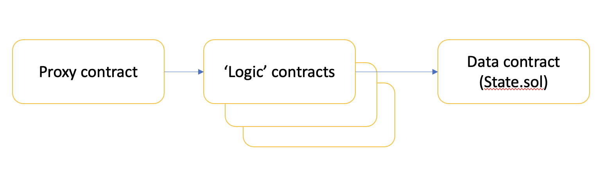

# Upgrading and Migrating contracts

We consider two approaches:  *Upgrading* existing contracts to a new version but retaining
state data as-is, and; *migrating* users to a completely new set of contracts.

We would only migrate in the event of a key loss, which prevents upgrading contracts.

## Upgrade contracts approach

Our contracts are already mostly divided into contracts that contain data and contracts that
contain logic. This is fortuitous for the pattern we are going to use.

`State.sol` contains most of the state, with some in `Shield.sol`.
This division could be made complete by moving the following functions out of `State.sol`
- `proposeBlock`
- `removeProposer`
- `emitRollback`
- `isBlockReal`
- `rewardChallenger`
- `removeProposer`

and moving the `Shield.sol` data into `State.sol`. `State.sol` will then only contain storage data
and getters/setters for the same. Note that it also holds nightfall's escrow pool and so needs to host `withdraw`.
It will also need modifying so that the addresses of the logic contracts, which it allows to
set state, can be updated by a registered contract containing an `upgrade` function (see later).

After that is done, we will never upgrade the `State.sol` contract but will upgrade the
stateless logic contracts. The logic contracts call `State.sol` and thus we avoid the use of
`delegateCall`. If, in the future, `State.sol` becomes insufficient for our needs, another
data contract can be deployed alongside, which adds the new storage variables needed.

We will create a set of contracts, which proxy calls to the logic contracts (one for each logic contract). This avoids users
having to repoint their applications to the new contracts. The `Proxy.sol` contracts will also
contain the `upgrade` function (we could have a single `Proxy.sol` which deals with all contracts but this
is less flexible if we want to add new logic contracts). These contracts must be ERC1967 compliant.

### upgrade function

This function will, atomically, carry out the following actions:

1. Repoint `State.sol`'s registered logic contracts to the new logic contracts;
1. Repoint `Proxy.sol` contracts to the new contracts;
1. Change the addresses of the contracts registered with `State.sol` to the new contract addresses;
1. Store the address of the old contracts and the block number at which the swap-over occurred in `State.sol`; this
will be used to help nightfall applications parse historic events and calldata. This will be in the form of
an array, added to each time the contracts are upgraded.
1. Call `selfdestruct` on the old logic contracts (to return gas and to ensure that the old contracts cannot be used to scam people);
1. Emit an event advertising the upgrade;

We will ensure that a unique private key is needed to call `upgrade`.

Note: The nightfall applications will need to be updated so that they can sync events and calldata on startup,
which may have changing contract addresses, reflecting historic contract upgrades.

Note: it must be possible to change the key that enables `upgrade` to be called. This is so we can
remove the ability to upgrade in the future and enable full decentralisation.

## Migrate contracts approach

In rare circumstances an upgrade may not be possible; the only use-case is probably compromise of the upgrade
private key.  If this happens we would deploy an entirely new set of contracts. Rather than attempt to
migrate storage data (which would be difficult because of the number of mapping types, and the need to
freeze updates for the old contract data, which would require a wait of one finalisation period, ~1 week and may not be
possible if the relevant key is compromised), we will simply advertise the new contract addresses and recommend
that people upgrade by removing their funds from the old contract.

## other

We will include a function to pause nightfall, in case we need to copy over finalised state at any time.
