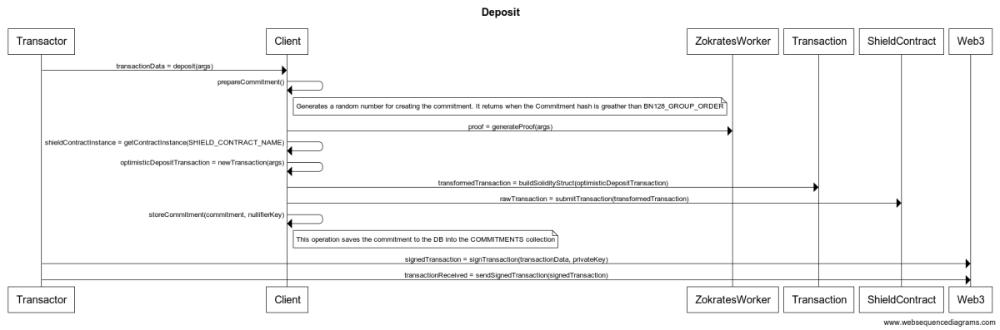

# Diagrams
The diagrams contained in this folder are generated using the Websequencediagrams [website](https://www.websequencediagrams.com/). Each diagram has a file `.webseqdiagram` containing the source-code of the diagram, as well an image generated from the source-code. For changing the diagram, one should go to the Websequencediagram website, paste the source-code on the left panel and change it accordingly. After changing, please, remember of save the source-code into the respective diagram file and push the updates.

## The Deposit diagram

