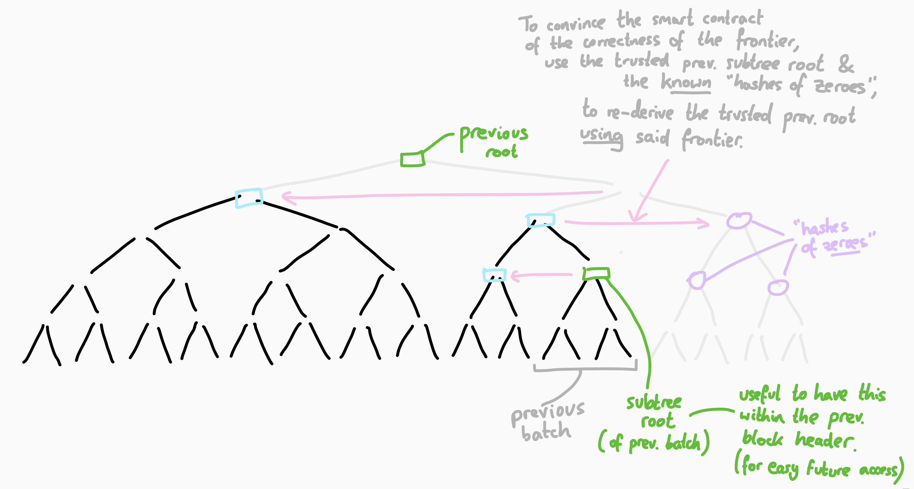
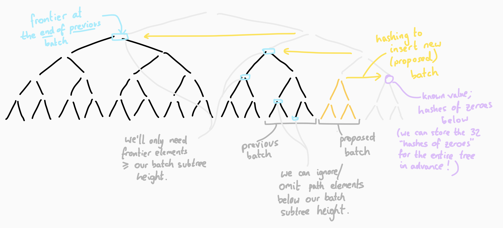

# An optimistic 'transfer'.

## Notation

- `C` - commitment
- `CT` - commitment tree
- `CR` - commitment root
- `CR_hist` - some historic commitment root
- `N` - nullifier
- `NT` - nullifier tree (the below gives an example of using a nullifier tree)
- `NR` - nullifier root

## Transactor

Each transactor submits to a proposer transaction data:

- `{ proof, C, N, CR_hist, fee }`

(Note: for a fungible transfer, there are actually two commitments and two nullifiers, but to keep
the notation simple, let's just consider non-fungible here).

## Proposer

The Proposer collates `n = 2^k` transactions.

So the Proposer has a set of `n` transactions:

- `{ proof_0, C_0, N_0, CR_hist_0, fee_0 }`
- `{ proof_1, C_1, N_1, CR_hist_1, fee_1 }`
- ...
- `{ proof_i, C_i, N_i, CR_hist_i, fee_i }`
- ...
- `{ proof_{n-1}, C_{n-1}, N_{n-1}, CR_hist_{n-1}, fee_{n-1} }`

The subscript `i` indicates a transaction within a block of `n` transactions.

Suppose, prior to this proposer proposing these `n` transactions, there are `j` transactions already
in our 'optimistic blockchain'. I.e. the commitment tree already contains `j` commitments, and the
nullifier tree contains `j` nullifiers.

We'll write `CT_j` and `NT_j` to indicate that these trees contain `j` commitments/nullifiers at
this stage.

The Proposer carries out the following checks in _Javascript_ (i.e. off-chain):

For each transaction `txData_i`:

- Check `fee_i` is worthwhile (to justify including the tx in the first place).
- Verify `proof_i`.
- Check the uniniqueness of all nullifiers `N_i` (relative to all the other proposed `N_i`'s of this
  block).
- Add each `N_i` to the nullifier tree, in turn:
  - To add the `i`'th nullifier to the tree `NT_{j+(i-1)}`...
  - Retrieve `NT_{j+(i-1)}` from the Timber DB (we'll need a version of Timber for the nullifier
    tree).
  - Note that `N_i` is just a number, and because the nullifier tree is a sparse merkle tree, each
    value `N_i` will be added to the tree at index `N_i`.
  - Check the leaf at leafIndex `N_i` was previously empty, by looking up Timber's nullifier tree
    DB.
  - Insert the leaf `N_i` at leafIndex `N_i` by hashing with its sibling path `sibling_path(N_i)` up
    the tree, to generate a new intermediate root `NR_{j+i}` of a new intermediate tree `NT_{j+i}`.
  - After this iteration of the loop, we've added `N_i` to the nullifier tree.
  - Since the adding of this leaf `N_i` changed hashes all the way up the tree, make sure these
    changes are reflected in the DB/in memory. We'll probably need a 'cached' version of the DB's
    tree for this proposal, in case our Proposer's eventual block doesn't 'win' the race to submit
    this block.

After that loop (^^^), we have a set of verified proofs, and a new nullifier tree `NT_{j+n}`
containing all the new nullifiers. Next steps:

- Add the commitments to the commitment tree.
  - Timber has a function which allows `n` leaves to be added at once, to drastically save on
    hashing. So we can actually add all the `n` commitment leaves `{C_0, C_1, ..., C_{n-1}}` at
    once, by calling this function.
  - So retrieve the old commitment tree `CT_j` from the DB, and then add the `n` leaves to get the
    new commitment root `CR_{j+n}`.
- Sum the fees:
  - `total_fee = fee_0 + fee_1 + ... + fee_{n-1}`

The Proposer now has an **'Optimistic block'** of information:

- `txData`:
  - `{ proof_0, C_0, N_0, CR_hist_0, fee_0 }`
  - `{ proof_1, C_1, N_1, CR_hist_1, fee_1 }`
  - ...
  - `{ proof_i, C_i, N_i, CR_hist_i, fee_i }`
  - ...
  - `{ proof_{n-1}, C_{n-1}, N_{n-1}, CR_hist_{n-1}, fee_{n-1} }`
- `blockHeaderData`:
  - `total_fee`
  - The Proposer's ETH address: `proposer_address`
  - `CR_{j+n}`
  - new `latestLeafIndex` of the commitment tree: `j+n`
  - `NR_{j+n}`
  - And we'll also need the root of the subtree containing the batch of commitments. Call it a
    'subtree root'. (See commitment challenge).

## Proposal submission

Suppose it's block number `m` that the Proposer is proposing.

The Proposer **submits** (or '**proposes**') this block's data.

All `txData` and `blockHeaderData` data is submitted to a `propose()` function, and the smart
contract processes this proposal in the following way:

- Hashes `h(txData)` to get a `txDataHash` (against which future challenges can be validated).
- Stores this `txDataHash` against optimistic block number `m`.
- Hashes `h(blockHeaderData)` to get a `blockHeaderHash` (against which future challenges can be
  validated). The `blockHeaderData` is hashed separately in this way to enable some more efficient
  challenge lookups later. Separating `blockHeaderData` and `txDataHash` isn't absolutely necessary;
  it's just a quick efficiency idea.
- Stores this `blockHeaderHash` against optimistic block number `m`.
- Emits all the `txData` and `blockHeaderData` through events.

## Challenges

Naming in this section might differ from the code that's already been written, just because I'm
typing this out without referring to that naming. Hopefully the meaning is conveyed.

### Bad proof

If a challenger disagrees with `proof_i` of the batch (i.e. that
`verify(proof_i, inputs = [C_i, N_i, CR_hist_i, fee_i]) = false`), then they submit to:

```solidity
CHALLENGE_PROOF(
    block_num = m,
    tx_index = i,
    txData
)
```

The smart contract then does the following:

- Input validation: checks `h(txData)` equals the earlier-stored `txDataHash` for optimistic block
  `m`.
- Extracts `{ proof_i, C_i, N_i, CR_hist_i, fee_i }` from the `txData`.
- Calls `verify()` on this data.
- If `verify() = false` then it rejects the block (and any subsequent blocks built on top of it).

### Bad `total_fee`

If a challenger disagrees with `total_fee` in the block header (i.e. that the Proposer has
miscalculated a simple summation of the fees), they submit to:

```solidity
CHALLENGE_TOTAL_FEE(
    block_num = m,
    txData,
    blockHeaderData
)
```

The smart contract then does the following:

- Input vaidation: checks `h(txData)` equals the earlier-stored `txDataHash` for optimistic block
  `m`.
- Input validation: checks `h(blockHeaderData)` equals the earlier-stored `blockHeaderHash` for
  optimistic block `m`.
- Extracts `fee_0, fee_1, ..., fee_{n-1}` from the `txData`.
- Extracts `total_fee` from the `blockHeaderData`.
- Checks whether or not `fee_0, fee_1, ..., fee_{n-1} == total_fee`
- Rejects accordingly

### Bad commitment tree update

If a challenger disagrees with the update to the commitment tree. Disagreements could be:

- Some commitments weren't added
- Some commitment values weren't added correctly
- Some historic commitments have been tampered with.

In all cases, the problem can be demonstrated to the smart contract by having it start from the
prior block's commitment root `CR_j` and add the batch of `n` commitments (the `C_i`'s). If the
eventually-calculated commitment root doesn't match the originally-proposed `CR_{j+n}`, then the
proposal should be rejected.

```solidity
CHALLENGE_COMMITMENT_TREE_UPDATE(
    block_num = m,
    txData_m,
    blockHeaderData_m,
    blockHeaderData_{m-1},
    frontier_{m-1},
)
//  where `frontier_{m-1} is the frontier at the end of the prior block.
```

The smart contract then does the following:

- Input vaidation: checks `h(txData_m)` equals the earlier-stored `txDataHash` for optimistic block
  `m`.
- Input vaidation: checks `h(blockHeaderData_m)` equals the earlier-stored `blockHeaderHash` for
  optimistic block `m`.
- Input vaidation: checks `h(blockHeaderData_{m-1})` equals the stored `blockHeaderHash_{m-1}` for
  optimistic block `m-1`.
- Extracts all `C_i`'s from the `txData_m`.
- Extracts the latest commitment root `CR_{j+n}` and `latestLeaf_m = j+n` from the
  `blockHeaderData_m`.
- Extracts the previous commitment root `CR_j` and `latestLeaf_{m-1} = j` from the
  `blockHeaderData_{m-1}`.

Before we can use the input `frontier_{m-1}` in our calculations, we'll need the smart contract to
validate that the input `frontier_{m-1}` is actually correct. So take the previous batch's subtree
root and hash it against the `frontier_{m-1}` (the and "hashes of zeroes", depending on the
left-rightness of the subtree root's index (derived from `latestLeafIndex_{m-1}`)), up the tree, to
recalculate the previous block's root (see diagram below). Upon comparing the result against the
previously-stored root `CR_j`, the smart contract will be convinced of the `frontier_{m-1}`'s
correctness. See diagram below:



Now the smart contract can add all commitments from the new batch, in order to evaluate the
challenge. The smart contract will:

- Hash all `n = 2^k` commitments `C_i` into a subtree, to get a subtree root for this batch.
- Hash the subtree root against the `frontier_{m-1}` (and "hashes of zeroes", depending on the
  left-rightness of the subtree root's index (derived from `latestLeafIndex_m`)), to derive the
  _correct_ commitment tree root (see diagram below).
- Compare the calculated commitment tree root against the purported `CR_j`. If they don't match,
  then reject the Proposer's proposal.



## Aside: Nullifier tree

Whilst this doc includes an example of how a nullifier tree may be used, that's not the main purpose
of this doc. There's lots of other good stuff outlined too. The nullifier tree stuff is just a juicy
bonus.

### Argument for using a nullifier tree

I'm inserting this section last, after having already written everything above and below. I was
going to argue that storing a single root is much cheaper than storing all the nullifiers. And
indeed it is...

But here's another idea that is also very light on storage...

Don't have a giant sparse nullifier tree. Instead, with each batch, submit all `n` nullifiers with a
proposal (as we already do), and have the smart contract keccak-hash this batch into a little
_subtree_ (triangle) of nullifiers, generating a `nullifierBatchSubtreeRoot`. Include this
`nullifierBatchSubtreeRoot` in the block header (which itself gets compressed into a
`blockHeaderHash`). This doesn't cost any extra storage space. And since the protool requires all of
a proposal's data to be keccak-hashed anyway, hashing the nullifiers in a particular structure
doesn't cost any extra.

If the nullifiers are all unique, they'll go unchallenged.

Offchain, a client can easily query a DB of historic nullifiers to see if any of the newly-proposed
nullifiers are duplicates. If one (or more) of the nullifiers is a duplicate of some historic
nullifier, the Challenger can submit a challenge which the smart contract can check.

Suppose the Challenger challenges that the newly-proposed nullifier `N_i` (of proposed block number
`m`) is a duplicate of some historic nullifier (also equal to `N_i`) of some earlier block number
`b`:

```solidity
CHALLENGE_NULLIFIER_UNIQUENESS(
    block_number = m,
    nullifier = N_i,
    tx_index = i, // index of nullifier in proposed block's nullifier subtree
    blockHeaderData,
    nullifierSiblingPath,
    historic_block_number = b,
    historic_tx_index = l, // index of historic nullifier in its block's subtree
    historicBlockHeaderData,
    historicNullifierSiblingPath,
)
```

Then the smart contract can do the following:

- Input validation: check that `h(blockHeaderData)` equals the stored `blockHeaderHash` for proposed
  block number `m`.
- Input validation: check that `h(historicBlockHeaderData)` equals the stored `blockHeaderHash` for
  historic block number `b`. nullifierBatchSubtreeRoot
- Extract `nullifierBatchSubtreeRoot` from `blockHeaderData`.
- Extract `historicNullifierBatchSubtreeRoot` from `historicBlockHeaderData`.
- Demonstrate existence of `N_i` in the `nullifierBatchSubtreeRoot` by hashing against the input
  `nullifierSiblingPath`, using the input `tx_index = i` for left-rightness.
- Demonstrate existence of _the same_ `N_i` in the `historicNullifierBatchSubtreeRoot` by hashing
  against the input `historicNullifierSiblingPath`, using the input `historic_tx_index = l` for
  left-rightness.

And there we have it. If everything checks out, then the smart contract has been convinced that
`N_i` is a duplicate nullifier, and the proposed block should be rejected.

#### Conclusion of this section:

I think that approach I've just described might be the cheapest and cleanest approach for optimistic
nullifiers. It's interesting; because we're doing things optimistically, we don't actually need to
prove _non-membership_ anywhere. At the point of challenging, we're always trying to prove the
_opposite_ of what a conventional zkp tx would try to prove. I.e. we're trying to prove
(demonstrate) _membership_ of the nullifier in some historic block. The above is a cheeky
exploitation of that.

**If you agree with the above nullifier idea, you might not need to read the detailed explanations
for dealing with a sparse nullifier tree's challenges. (Although, if might still be a worthwhile
exercise to read it all.)**

If you disagree with the above nullifier idea, read on for details on challenging things about the
sparse nullifier tree.

I haven't discussed simply storing all `n` nullifiers of a batch at the time of proposal. It's too
expensive\* and leads to messiness when trying to 'delete' fraudulent blocks.

E.g. for a batch of 32 nullifiers, it's 32 _ 20,000 = 640,000 gas for storage and 32 _ 800 = 25,600
gas for SLOADs (to check uniqueness). The act of checking uniqueness at submission also goes against
the idea of 'optimism'. It's actually double those gas amounts when we consider a batch of 32
_fungible_ transfers. So 1.3 million gas vs 20,000 gas (to not store nullifiers) is quite
convincing.

## Challenges (continued...)

Note that everything below deals with challenging nullifiers when they're structured in a sparse
merkle tree. An idea immediately above might be better than a sparse merkle tree.

### Bad: nullifier `N_i` already existed

If a challenger disagrees with a nullifier `N_i` (that it already exists):

```solidity
CHALLENGE_NULLIFIER_ALREADY_EXISTS(
    block_num = m,
    nullifier_index = N_i,
    txData,
    blockHeaderData_{m-1},
    sibling_path(N_i)_{m-1}
)
// notice we provide `blockHeaderData` and `siblingPath` data from the _prior_
// optimistic block, because we need to demonstrate that the 'bad nullifier'
// already existed in the _previous_ block's nullifier tree.
```

The smart contract then does the following:

- Input validation: checks `h(txData)` equals the earlier-stored `txDataHash` for optimistic block
  `m`, to gain confidence in the data.
- Input vaidation: checks `h(blockHeaderData_{m-1})` equals the stored `blockHeaderHash_{m-1}` for
  optimistic block `m-1` (_the prior block_), to gain confidence in the data.
- Extracts the nullifier `N_i` from the `txData`, to validate the input parameter `N_i`.
- Extracts the nullifier root `NR_j` from the previous optimistic block `blockHeaderData_{m-1}`.
- Checks whether the hashing of the nullifier `N_i` against the `sibling_path(N_i)_{m-1}` of the
  prior block, actually results in the root of the prior block's nullifier tree `NR_j`. If it
  successfully calculates `NR_j`, then this calculation has demonstrated that the leafIndex `N_i`
  already existed in the tree!
- Rejects accordingly

### Bad: nullifier `N_i` not added correctly

If a challenger suspects a nullifier `N_i` from the `txData` hasn't been added to the nullifier tree
correctly, i.e.:

- Not added at all, in which case the leaf is still `0`.
- An incorrect leafValue has been added to leafIndex `N_i` (i.e. a value not equal to `N_i`).

To demonstrate this challenge, the smart contract must realise that the leaf value at leafIndex
`N_i` is not `N_i`. Bear in mind, the challenger might not know _what_ value has actually been added
at this position (if it's not the `N_i` that got emitted at the proposal stage, who knows what it
could be?!), and if they don't know what value got added, then there will be nodes all the way up
the tree that will be irreconcilable (to the Challenger)! So, the Challenger might not know the leaf
or the sibling path for leafIndex `N_i` that would allow them to demonstrate "the value here is not
`N_i`." But it's ok! The challenger's challenge will just have to ask the smart contract to add each
nullifier from the proposed batch, one-by-one, to the tree of the previous block. Once the smart
contract has added the final leaf, it can compare its correctly calculated root against the
proposer's purported (incorrect) root. So this challenge demonstrates incorrect nullifier(s) by
demonstrating inconsistency relative to the prior op-block's nullifier root.

```solidity
CHALLENGE_NULLIFIER_TREE_UPDATE(
    block_num = m,
    txData_m,
    blockHeaderData_m,
    blockHeaderData_{m-1},
    sibling_paths_{m-1}
)
// where `sibling_paths_{m-1}` is an array of _all_ `n` siblingPaths;
// one for each of the `n` nullifiers `N_i` that were proposed for block `m`,
// but crucially, these siblingPaths are from `NT_j`;
// the nullifier tree _before_ the new nullifiers get added.
```

The smart contract then does the following:

- Checks `h(txData_m)` equals the earlier-stored `txDataHash` for optimistic block `m`.
- Checks `h(blockHeaderData_m)` equals the earlier-stored `blockHeaderHash` for optimistic block
  `m`.
- Checks `h(blockHeaderData_{m-1})` equals the stored `blockHeaderHash_{m-1}` for optimistic block
  `m-1`.
- Extracts all `N_i`'s from the `txData_m`.
- Extracts the latest nullifier root `NR_{j+n}` from the `blockHeaderData_m`.
- Extracts the _previous_ nullifier root `NR_j` from the `blockHeaderData_{m-1}`.
- We can use the fact that the leaves for these new nullifiers were `0` ("empty") in the prior
  block, in order to demonstrate the validity of each siblingPath that's been passed as a parameter
  by the Challenger:
  - For each `siblingPath_i`, hash up the tree starting with leafValue `0`, using the leafIndex
    `N_i` to determine left-rightness when hashing.
  - If the calculated root each time is `NR_j`, then we've convinced the smart contract of the
    validity of the siblingPaths. So now the smart contract can happily use these validated
    siblingPaths to add each new nullifier `N_i` to the tree, knowing that the root it eventually
    ends up at will definitely be the correct answer. It will find that the Proposer's proposed root
    won't match, and so will reject the proposer's root (and block).
- Add each nullifier `N_i` to the tree, by hashing with `siblingPath_i`.
- Note that as each `N_i` is added, some nodes of the so-far-unused siblingPaths will need to be
  updated. Eventually a root will be calculated, and the smart contract will find that it doesn't
  match the proposer's claim. Naughty proposer.

### Bad: a historic value in the nullifier tree has been cheekily changed.

_Spoiler alert: this can be checked using the same method as the previous challenge. I.e. this and
that are both the same challenge function._

If a Proposer cheekily _changes_ some historic leaves of the nullifier tree, we need to challenge
this. It's simple for the Challenger to identify. After they've received the Proposer's block data
(which is emitted as an event), the Challenger should attempt to reconsile the Proposer's purported
new nullifier root `NR_{j+n}` (by starting with the previous op-block's nullifier root `NR_j` and
adding all of the new nullifier leaves). If the eventual nullifier root calculated by the Challenger
isn't equal to the proposed `NR_j`, then the Proposer has either maliciously changed a historic
value, or not added the nullifiers correctly.

The challenge function for this is the same as the previous section.

### Bad nullifier root `NR_{j+n}`

_Spoiler alert: This on-chain challenge logic is the same as the previous challenge._

If a Challenger disagrees with the block `m`'s nullifier root `NR_{j+n}` (the subscript notation
meaning the root of the tree which contains `j+n` nullifiers), then the Challenger is actually
saying "I don't think you can reach that root from the previous root, if you add this set of
nullifiers.".

So the challenge they submit should demonstrate that "previous root plus nullifiers is not equal to
proposed new root".

This on-chain challenge logic is the same as the previous challenge.
