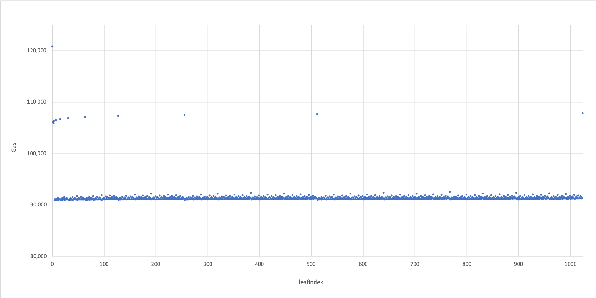
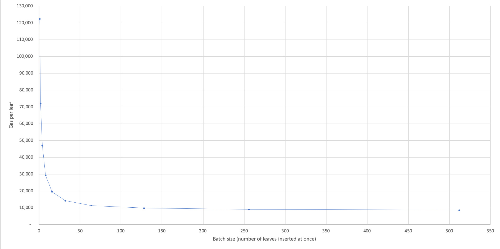
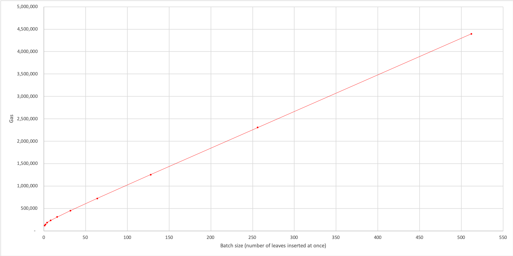
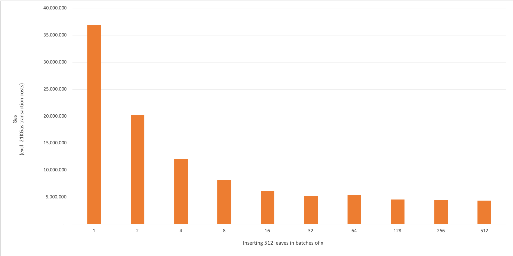

# timber :evergreen_tree:

Construct a Merkle Tree database from Ethereum logs.  

<sub><sup>Originator: [iAmMichaelConnor](https://github.com/iAmMichaelConnor)</sup></sub>

---

<!-- START doctoc generated TOC please keep comment here to allow auto update -->
<!-- DON'T EDIT THIS SECTION, INSTEAD RE-RUN doctoc TO UPDATE -->


- [Summary](#summary)
- [In this repo...](#in-this-repo)
- [Quick Start:](#quick-start)
  - [Prerequisites](#prerequisites)
  - [Installing](#installing)
  - [Starting](#starting)
  - [Using](#using)
    - [Example usage:](#example-usage)
      - [Add leaves to the tree:](#add-leaves-to-the-tree)
      - [Start the event filter:](#start-the-event-filter)
      - [Update the merkle-tree database:](#update-the-merkle-tree-database)
      - [Get information from the merkle-tree database:](#get-information-from-the-merkle-tree-database)
  - [Stopping](#stopping)
  - [Testing](#testing)
- [Start-up configuration](#start-up-configuration)
  - [`docker-compose.<...>.yml` options](#docker-composeyml-options)
    - [`CONTRACT_ORIGIN`](#contract_origin)
      - [`default`](#default)
      - [`remote`](#remote)
      - [`mongodb`](#mongodb)
      - [`compile`](#compile)
    - [`HASH_TYPE`](#hash_type)
  - [config](#config)
    - [`contracts`](#contracts)
    - [`treeId`](#treeid)
    - [`TREE_HEIGHT`](#tree_height)
- [API](#api)
  - [merkle-tree endpoints](#merkle-tree-endpoints)
    - [`/start`](#start)
    - [`/update`](#update)
    - [`/siblingPath/:leafIndex`](#siblingpathleafindex)
    - [`/path/:leafIndex`](#pathleafindex)
  - [metadata endpoints](#metadata-endpoints)
  - [leaf endpoints](#leaf-endpoints)
    - [`/leaf`](#leaf)
    - [`/leaves`](#leaves)
  - [node endpoints](#node-endpoints)
    - [`/node`](#node)
    - [`/nodes`](#nodes)
    - [`/root`](#root)
- [Gas Costs](#gas-costs)
  - [`insertLeaf`](#insertleaf)
  - [`insertLeaves`](#insertleaves)
- [Technical Details:](#technical-details)
  - [Summary](#summary-1)
  - [Details](#details)
    - [On-chain logic](#on-chain-logic)
      - [Inserting leaf 0](#inserting-leaf-0)
      - [Inserting leaf 1](#inserting-leaf-1)
      - [Future inserts](#future-inserts)

<!-- END doctoc generated TOC please keep comment here to allow auto update -->

---

## Objectives
1)   Keep track of a Merkle Tree's root on-chain;
2)   Minimise the gas cost of adding leaves to the Tree;
3)   Minimise the gas cost of updating the root;
4)   Ensure data availability;

---

## Summary

Leaves are submitted to a `MerkleTree` smart-contract by users. Submitting multiple leaves in-bulk results in considerable gas cost savings per leaf.

Only the `root` and a small `frontier` of nodes is stored on-chain. New leaves are not stored on-chain; they're emitted as events.

A local merkle-tree database (off-chain) is populated with the leaves and nodes of the Tree, based on `NewLeaf` events emitted by the smart-contract.

The database can then be queried, e.g. for sibling-paths in order to provide set-membership proofs.

**Disclaimer: Note that this code has not yet completed a security review and therefore we strongly recommend that you do not use it in production. We take no responsibility for any loss you may incur through the use of this code.**

---

## In this repo...

```
./docker-compose.yml <-- 'startup' configuration
|
./merkle-tree/ <-- the 'main' microservice of this repo
    |
    config/
        |
        default.js  <-- specify important config parameters
    |
    src/
        |
        db/ <-- database services for managing the merkle-tree mongodb
        |
        routes/ <-- API routes for externally accessing this microservice
        |
        filter-controller.js <-- Ethereum event filter
        |
        merkle-tree-controller.js <-- merkle-tree update & calculation controller
|
./deployer/ <-- example 'stub' microservice, demonstrating how one would use
                'timber' as part of an application
      |
      contracts/ <-- example MerkleTree.sol contracts for efficient merkle-tree updates
```

---

## Quick Start:

### Prerequisites

The merkle-tree miscroservice requires the following software to run:

-   Docker
-   Node.js (tested with node 10.15.3) with npm and node-gyp.
-   Xcode Command line tools:
    -   If running macOS, install Xcode then run `xcode-select --install` to install command line tools.

### Installing

Clone the merkle-tree repository and use a terminal to enter the directory.

### Starting

Start Docker:  

-   On Mac, open Docker.app.

If you have pulled new changes from the repo, then first run:  

```sh
docker-compose build
```
Start all microservices:  

```sh
docker-compose up
```

It's up and running!

### Using

#### Logging

The logging level in Timber can be set to any of: error; warn; info; http; verbose; debug; silly (default: info), via the environment variable `LOG_LEVEL`.

#### Example usage:

##### Add leaves to the tree:

Submit loads of leaves to the `MerkleTree.sol` smart contract. We can do this easily in another terminal window:  
`docker-compose run --rm deployer npx mocha --exit --require @babel/register 'test/MerkleTreeController.test.js'` will submit many leaves.


Interact with the merkle-tree microservice through its API. A postman collection (for local testing) is provided at [./merkle-tree/test/postman-collections/](merkle-tree/test/postman-collections/).

##### Start the event filter:

Send a `post` request to `http://localhost:9000/start` to start the merkle-tree's event filters for `NewLeaf` and `NewLeaves` events. Any 'new leaf' events will be picked up by the filters, and cause the new leaf data to be inserted into the mongodb.

You can ask Timber to start automatically by setting the environment variable `AUTOSTART` to anything that is truthy.  This is useful when you are deploying another Timber instance to an already-running ZKP solution. In this case, Timber will take contract (name, address, treeId) from its config file. Depending on your configuration, not all of these may be needed.  Often Timber can infer the contract address from build artefacts.  

If `AUTOSTART` is used, it will attempt to obtain a contract address and will try to do this `AUTOSTART_RETRIES` (default 20) times, every three seconds, before giving up.  This is useful if the contracts are not deployed before Timber is started.

##### Update the merkle-tree database:

Send a `patch` request to `http://localhost:9000/update`. Given the leaves now stored in the mongodb, this `update` command will calculate all of the intermediate nodes from the leaves to the root, and store all of these nodes in the mongodb.

##### Get information from the merkle-tree database:

Send a `get` request to `http://localhost:9000/siblingPath/3`. This will retrieve from the mongodb the sibling-path for the leaf with `leafIndex = 3`.


### Stopping

If you want to close the application, make sure to stop containers and remove containers, networks, volumes, and images which were created by `up`, using

```sh
docker-compose down -v
```

### Testing

See the [deployment README](deployer/test/README.md) for unit tests.


---

## Start-up configuration

There are several startup options which we can specify for Timber.
Some are specified in Timber's `docker-compose.<...>.yml` file; others are specified in the config file mounted to `app/config/default.js`.

### `docker-compose.<...>.yml` options

We provide four example `docker-compose.<...>.yml` files to demonstrate the four start-up options (based on `CONTRACT_ORIGIN`).

#### `CONTRACT_ORIGIN`

Timber relies on being 'fed' details about the contracts it should subscribe to. When we POST to the `/start` endpoint of Timber, it will search for contract details at the `CONTRACT_ORIGIN` location we have specified.

Importantly, Timber expects smart contract interface json filesin `/app/build/contracts` to have the following format:
```
{
  abi: "...",
  evm:
    bytecode:
      object: "0x..."
}
```  

`0x/sol-compiler` outputs JSON in this format:
```
{
  compiledOutput:
    abi: "...",
    evm:
      bytecode:
        object: "0x..."
}
```

`truffle compile` outputs JSON in this format:
```
{
  abi: "...",
  bytecode: "0x...."
}
```

Timber uses the `abi` field but does not currently use `bytecode`, so truffle's format works without any translation.

We use the `CONTRACT_ORIGIN` environment variable to specify one of four options:

##### `default`
Timber will look for solc-compiled contract interface json files in `/app/build/contracts`. You'll need to mount the relevant interface json files to this location.

##### `remote`
Timber will `GET` the solc-compiled contract interface json files from some external container. We call this external container 'deployer' (because, presumably it has deployed the contracts).
You will need to specify two extra environment variables:
`DEPLOYER_HOST: http://<host name of deployer>`
`DEPLOYER_PORT: 80`

##### `mongodb`
Timber will get the solc-compiled contract interface json files from a mongodb collection.

##### `compile`
If no _solc_-compiled json files are available, then we'll need Timber to compile the contracts itself (using solc) from solidity files. You'll need to mount the relevant solidity files (including dependencies) to `app/contracts/`. Timber will then compile the `.sol` files itself, and store the contract interface json files in `app/build/contracts`.

#### `HASH_TYPE`

For hashing 'up the merkle tree', there are currently two supported hash types:
`sha` or `mimc`. You can also choose which elliptic curve `mimc` hashing is computed over. The 'default' option (when no `CURVE` is defined in the startup options) is ALT_BN_254.

| HASH_TYPE  | Algorithm	| Curve    | Cost* (gas))	| Proving time  	| Constraints**	|
|:-:	       |:-:	        |:-:       | --:	          |--:	            |--:          	|
| `sha`  	   | sha256   	| n/a       | ~90k         |  slow 	        | ~25,000	      |
| `mimc`	   | MiMC-p/p  	| ALT_BN_254      | ~1.4m    	  |  fast 	        | ~740        	|
| `mimc`	   | MiMC-p/p  	| BLS12_377      | ~1.8m    	  |  fast 	        | ~1000        	|


\*cost of hashing 32 times up a merkle tree.
\**for a single hash of two inputs

### config

Many options can be specified in the config file mounted to `app/config/default.js`. Some important options are highlighted below:

#### `contracts`

Specify which contracts, events, and event parameters to subscribe to.
E.g.:
```js
// contracts to filter:
contracts: {
  // contract name:
  MerkleTreeControllerSHA: {
    events: {
      // filter for the following event names:
      NewLeaf: {
        // filter for these event parameters:
        parameters: ['leafIndex', 'leafValue'],
      },
      NewLeaves: {
        // filter for these event parameters:
        parameters: ['minLeafIndex', 'leafValues'],
      },
    },
  },
},
```
**Note:** Requests to the API must specify the `contractName` in the body of the request.
By specifying the `contractName`, Timber will know: which contract to interact with; and which db collection to get from, insert to, or update.

E.g. `"contractName": "MerkleTreeControllerSHA"`


#### `treeId`

The structure above assumes you have one tree per contract. If your application requires multiple trees per contract, you can specify a `treeId` (and height) for each. This tells Timber to create a separate db collection for each id.
E.g.:
```js
// contracts to filter:
contracts: {
  // contract name:
  MultipleMerkleTreesControllerSHA: {
    treeId: {
      a: {
        treeHeight: 16,
        events: {
          // filter for the following event names:
          NewLeafA: {
            // filter for these event parameters:
            parameters: ['leafIndex', 'leafValue'],
          },
          NewLeavesA: {
            // filter for these event parameters:
            parameters: ['minLeafIndex', 'leafValues'],
          },
        },
      },
      b: {
        treeHeight: 10,
        events: {
          // filter for the following event names:
          NewLeafB: {
            // filter for these event parameters:
            parameters: ['leafIndex', 'leafValue'],
          },
          NewLeavesB: {
            // filter for these event parameters:
            parameters: ['minLeafIndex', 'leafValues'],
          },
        },
      },
    },
  },
},
```
**Note:** If the contract has multiple trees, all requests to the API must specify the `treeId` in the body of the request.

E.g. `{ "contractName": "MultipleMerkleTreesController", "treeId": "a" }`

If you submit a request to a contract with multiple trees without specifying `treeId`, Timber will throw an error. This is because it does not know which tree to direct the request to.

The event names must differ between trees so Timber knows which db collection to add the new leaves to. As long as the first event adds single leaves and the second adds multiple leaves, they can have any structure you like.

E.g. in config:
```js
events: {
  // filter for the following event names:
  NewLeaf: {
    // filter for these event parameters adding a single leaf:
    parameters: ['leafIndex', 'leafValue'],
  },
  NewLeaves: {
    // filter for these event parameters adding multiple leaves:
    parameters: ['minLeafIndex', 'leafValues'],
  },
},
```

By specifying the `contractName` and `treeId`, Timber will know: which contract to interact with; and which db collection to get from, insert to, or update.


#### `TREE_HEIGHT`
The height of the merkle tree.

Note that this height must match the height specified elsewhere in your application (e.g. the tree height in the merkle tree contract, or inside any zk-snark circuits).

If you have multiple merkle trees in one smart contract, be sure to define each tree's height under `treeId` in the config.

---

## API

The `merkle-tree` container (or 'service') exposes several useful endpoints.

If the microservices are started with the default `./docker-compose.yml` file, these endpoints can be accessed by other containers on the same docker network through <http://merkle-tree:80>.

To access the `merkle-tree` service from your local machine (which is not in the docker network), use <http://localhost:9000> by default.

A postman collection (for local testing) is provided at [./merkle-tree/test/postman-collections/](merkle-tree/test/postman-collections/).

**Note:** Requests to the API must specify the `contractName` in the body of the request.
By specifying the `contractName`, Timber will know: which contract to interact with; and which db collection to get from, insert to, or update.

E.g. `"contractName": "MerkleTreeControllerSHA"`

See `./merkle-tree/src/routes` for all api routes.

### merkle-tree endpoints
For interacting 'broadly' with Timber:
#### `/start`
Starts the event filter. Ensure to pass the relevant `contractName` in the req.body. If you have multiple trees in one contract, specify which `treeId` you want to start the filter for.
#### `/update`
Updates the entire merkle-tree db.
Once started (via `/start`), Timber will be listening to contract events for new leaves. These leaves will be stored in the db, but the nodes of the db (i.e. tree data 'above' the leaves) won't be updated automatically, because that would be a waste of computation (node data would be constantly overwritten with each new leaf). Any time we want to GET up-to-date node information from the db, we must first call `/update` in order to update all nodes of the tree, based on the current set of leaves in the tree.

**Note**: when calling the `/path` or `/siblingPath` getters, an `/update` is done automatically, so that the path being returned is up-to-date.

#### `/siblingPath/:leafIndex`
Get a siblingPath (an array of nodes) for a particular leafIndex. This endpoint will be used frequently, for merkle inclusion proofs.

#### `/path/:leafIndex`
Get a path (an array of nodes) for a particular leafIndex.

### metadata endpoints
There are several `/metadata/` endpoints for getting/setting data about the tree. E.g. `contractAddress`, `contractInterface`, `latestLeaf`, `latestRecalculation`.

### leaf endpoints
For getting/inserting/updating information relating to leaves of the tree.
#### `/leaf`
- `GET`
  - `/leaf/index/:leafIndex` Get a leaf by leafIndex  
  - `/leaf/index` Get a leaf by leafIndex  
  - `/leaf/value` Get a leaf by leafValue  
  Note that the latter two are not restful endpoints and the leafIndex or the leafValue should be passed in as GET query parameters {contractName, value}
- `POST`
  - **WARNING**: these POST requests were built for quick db testing only. In practice, insertions of leaves into Timber's merkle-tree db should only be done via the event subscriptions to MerkleTree smart contract(s). (See the `/start` endpoint for starting an event subscription).
  - `/leaf` Insert a leaf into the merkle-tree db.

#### `/leaves`
- `GET`
  - `/leaves` Get information about multiple leaves at once.
  There are several options, specified through the request body (DEPRECATED) or via query parameters:
    - `{ "leafIndices": [10, 15, 100000, 10000000] }`
      Specify a selection of leaves, by their leafIndices.
    - `{ "values": ["0x1234", "hello", "0x12345678"] }`
      Specify a selection of leaves, by their values.
    - `{ "minIndex": 10, "maxIndex": 1000 }`
      Specify a range of leaves, by the lower and upper bounds of the index range.
    - `{}`
      Get information about all leaves.  
  - `/leaves/check` Run some broad checks on the leaves of the tree, to check for corrupted filtering, or leaf tracking.
  - `/leaves/count` Get the number of leaves currently in the merkle-tree mongodb.
- `POST`
  - **WARNING**: these POST requests were built for quick db testing only. In practice, insertions of leaves into Timber's merkle-tree db should only be done via the event subscriptions to MerkleTree smart contract(s). (See the `/start` endpoint for starting an event subscription).
  - `/leaves` Insert multiple leaves into the merkle-tree db.

### node endpoints
For getting/inserting/updating information relating to nodes of the tree. A leaf is a special type of node (in that it has no children).
#### `/node`
- `GET`
  - `/node/index/:nodeIndex` Get a node by nodeIndex  
  - `/node/index` Get a node by nodeIndex  
  - `/node/value` Get a node by nodeValue  
- `POST`
  - **WARNING**: these POST requests were built for quick db testing only. In practice, insertions of nodes into Timber's merkle-tree db should only be done via the `/update` endpoint.
  - `/node` Insert a node into the merkle-tree db.
- `PATCH`
  - **WARNING**: these PATCH requests were built for quick db testing only. In practice, updates of nodes of Timber's merkle-tree db should only be done via the `/update` endpoint.
  - `/node` Update the nodes of the tree (see `/update` for a more detailed explanation).

#### `/nodes`
- `GET`
  - `/nodes` Get information about multiple nodes at once.
  There are several options, specified through the request body (DEPRECATED) or via query parameters:
    - `{ "nodeIndices": [10, 15, 100000, 10000000] }`
      Specify a selection of nodes, by their nodeIndices (can include leaves).
    - `{ "values": ["0x1234", "hello", "0x12345678"] }`
      Specify a selection of nodes, by their values  (can include leaves).
    - `{ "minIndex": 10, "maxIndex": 1000 }`
      Specify a range of nodes, by the lower and upper bounds of the index range      (can include leaves).
    - `{}`
      Get information about all nodes (includes leaves).
  - `/nodes/count` Get the number of nodes currently in the merkle-tree mongodb (includes leaves).
- `POST`
  - **WARNING**: these POST requests were built for quick db testing only. In practice, insertions of nodes into Timber's merkle-tree db should only be done via the `/update` endpoint.
  - `/nodes` Insert multiple nodes into the merkle-tree db.
- `PATCH`
  - **WARNING**: these PATCH requests were built for quick db testing only. In practice, updates of nodes of Timber's merkle-tree db should only be done via the `/update` endpoint.
  - `/nodes` Update the nodes of the tree (see `/update` for a more detailed explanation).

#### `/root`
- `GET`
  - `/root` Get the root of the tree.

---

## Gas Costs

The following gives gas cost measurements for inserting leaves into the MerkleTree.sol contract.

### `insertLeaf`
-   `treeHeight = 32`
-   32 sha256() hashes. We use assembly to minimise the cost of calling the sha256 precompiled contract (if HASH_TYPE = mimc, the gas cost will increase).
-   1,024 leaves inserted, one-at-a-time, from left to right.
-   Notice how there is a jump in cost every `2**n` leaves, when a new level of the `frontier` is written to for the first time.
-   The very first transaction costs the most, due to initialising of the `leafCount` and `latestRoot` parameters.
-   Gas values shown include the 21KGas transaction cost.



### `insertLeaves`

-   `treeHeight = 32`  

-   We explore the cost of inserting leaves in batches of varying sizes (doubling the batch size each time).
-   We insert each batch into an empty tree each time.
-   Gas values shown include the 21KGas transaction cost each time.
-   The Gas cost per leaf reduces asymptotically with batch size.
-   Batches of 128 leaves and over appear to start levelling out around 10,000 gas per leaf.





-   We also explore the cost of inserting a fixed total of 512 leaves, but in batches of varying sizes (doubling the batch size each time).
-   I.e.:
    -   512 transactions of batches of 1 leaf
    -   256 transactions of batches of 2 leaves
    -   64 transactions of batches of 4 leaves
    ...
    -   1 transaction of a batch of 512 leaves
-   We begin each set of transactions with an empty tree each time.
-   Gas values shown have been adjusted to exclude the 21KGas transaction cost each time. This helps hone in on the 'internal contract' gas costs, but massively understates the costs of multiple transactions of small batches (e.g. we're understating the cost of '512 transactions of batches of 1' by over 10MGas).
-   The gas cost for inserting a given number of leaves reduces asymptotically as batch size increases.
-   Beyond batches of 128 leaves, the gas savings begin to level out.



---

## Technical Details:

### Summary

**On-chain**  

The leaves of the tree are not stored on-chain, they're emitted as events.

The intermediate-nodes of the tree (between the leaves and the root) are not stored on-chain.

Only a 'frontier' is stored on-chain (see the detailed explanation below).  

**Off-chain**

We filter the blockchain for `NewLeaf` event emissions, which contain:

```
NewLeafEvent: {
  leafIndex: 1234,
  leafValue: '0xacb5678',
  root: '0xdef9012'
}
```

We then insert each leaf into a local mongodb database.  

With this database, we can reconstruct the entire merkle tree.

### Details


We consistently use the following indexing throughout the codebase:

```
Level Row                            nodeIndices                      frontier indices

  4    0                                  0                                  [4,
                           /                             \
  3    1                  1                               2                   3,
                   /             \                 /             \
  2    2          3               4               5               6           2,
               /     \         /      \        /      \        /      \
  1    3      7       8       9       10      11      12      13      14      1,
             /  \    /  \    /  \    /  \    /  \    /  \    /  \    /  \
  0    4    15  16  17  18  19  20  21  22  23  24  25  26  27  28  29  30    0]

leafIndices: 0   1   2   3   4   5   6   7   8   9  10  11  12  13  14  15

```

#### On-chain logic

We start with an empty `frontier = [ , , , , ]`.  

The frontier will represent the right-most fixed nodeValues at each level of the tree. So `frontier[0]` will be the right-most fixed nodeValue at level `0`, and so on up the tree. By 'fixed nodeValue', we mean that the `nodeValue` will never again change; it is permanently fixed regardless of future leaf appends.


##### Inserting leaf 0

A user submits the 0th leaf (`leafIndex = 0`) to the `MerkleTree` smart contract.

We add it to `leafIndex = 0` (`nodeIndex = 15`) in the contract's local stack (but not to persistent storage, because we can more cheaply emit this leaf's data as an event).

Let's provide a visualisation:

```
// Inserting a leaf with nodeValue = '15.0' into the tree

                                nodeValues                                frontier

                                    0                                     [    ,
                  /                                    \          
                 0                                      0                      ,
         /               \                   /               \       
        0                 0                 0                 0                ,
     /      \          /      \          /      \          /      \       
    0        0        0        0        0        0        0        0           ,
  /   \    /   \    /   \    /   \    /   \    /   \    /   \    /   \       
15.0   0  0     0  0     0  0     0  0     0  0     0  0     0  0     0        ]

  0    1  2     3  4     5  6     7  8     9 10    11 12    13 14    15 <-- leafIndices

```

We use the unusual notation `15.0` to mean "the `nodeValue` from the 0th update of nodeIndex `15`".

We now need to hash up the merkle tree to update the root. In order to do this, we need the `nodeValues` of the sibling-path of `leafIndex = 0`.

The 0th leaf is an easy case where the sibling-path nodes are always to the right of the leaf's path:

```
// Showing the sibling-path of leafIndex = 0

                                nodeValues                                frontier

                                    0                                     [    ,
                  /                                    \          
                 0                                     *0*                     ,
         /               \                   /               \       
        0                *0*                0                 0                ,
     /      \          /      \          /      \          /      \       
    0       *0*       0        0        0        0        0        0           ,
  /   \    /   \    /   \    /   \    /   \    /   \    /   \    /   \       
15.0  *0* 0     0  0     0  0     0  0     0  0     0  0     0  0     0        ]

  0    1  2     3  4     5  6     7  8     9 10    11 12    13 14    15 <-- leafIndices

*0* = "sibling-path nodeValue"

```
Hashing up the tree is easy in this case; if a sibling-node is to the right, then it must never have been updated before, and hence must have `nodeValue` `0`.

So it's easy to update the tree:

```
// Hashing computation to update the root for a newly inserted leaf at leafIndex = 0

frontier        nodeValue  = hash ( left input   ,   right input   )       zeros  

 [  ,              7.0     = hash (   15.0       ,        0        )    <--  0
    ,              3.0     = hash (    7.0       ,        0        )    <--  0
    ,              1.0     = hash (    3.0       ,        0        )    <--  0
    ,              0.0     = hash (    1.0       ,        0        )    <--  0
    ]
                    ^ these are the values in our recalculated path from leafIndex = 0
```

We will only use the `frontier` to inject sibling-nodes which are to the left of a leaf's path. More on that later.

Our updated tree can be visualised like this:

```
// Updating the path from leafIndex = 0 to the root:

                              nodeValues                                  frontier

                                  0.0                                      [   ,
                  /                                    \     
                1.0                                     0                      ,
         /               \                   /               \
       3.0                0                 0                 0                ,
     /      \          /      \          /      \          /      \
   7.0       0        0        0        0        0        0        0           ,
  /   \    /   \    /   \    /   \    /   \    /   \    /   \    /   \
15.0   0  0     0  0     0  0     0  0     0  0     0  0     0  0     0        ]

  0    1  2     3  4     5  6     7  8     9 10    11 12    13 14    15 <-- leafIndices

```
By `7.0`, we mean "the `nodeValue` from the 0th update of nodeIndex `7`", etc.

Note that nothing has yet been stored in persistent storage on-chain.

Notice now, that the `nodeValue` `15.0` will never change in future. Notice also that when we come to insert a new leaf to `leafIndex = 1`, its sister-path will include `nodeValue` `15.0` on its left. Therefore, when we come to update the root to include the new leaf, we will need to left-inject `nodeValue` `15.0` into our hashing computation.

Now the purpose of the `frontier` starts to become clear. We will add `nodeValue` `15.0` to `frontier[0]` (persistent storage), so that we can later left-inject it into our hashing computation when we come to insert `leafIndex = 1`.


```
// Adding a nodeValue to frontier[0]

                              nodeValues                                     frontier

                                  0.0                                          [    ,
                  /                                    \
                1.0                                     0                           ,
         /               \                   /               \
       3.0                0                 0                 0                     ,
     /      \          /      \          /      \          /      \
   7.0       0        0        0        0        0        0        0                ,
  /   \    /   \    /   \    /   \    /   \    /   \    /   \    /   \
15.0   0  0     0  0     0  0     0  0     0  0     0  0     0  0     0   -->   15.0]

  0    1  2     3  4     5  6     7  8     9 10    11 12    13 14    15 <-- leafIndices

```

The smart contract emits the leaf value as an event `NewLeaf`, which is then picked-up by `timber`'s event listener and added to the mongodb.

That completes the insertion of leaf 0.  

##### Inserting leaf 1

Let's add some more leaves (always appending them from left to right):

A user submits the 1th leaf (`leafIndex = 1`) to the `MerkleTree` smart contract.

We add it to `leafIndex = 1` (`nodeIndex = 16`) in the contract's local stack (but not to persistent storage, because we can more cheaply emit this leaf's data as an event).

Let's provide a visualisation:

```
// Inserting a leaf with nodeValue = '16.0' into the tree

                              nodeValues                                     frontier

                                  0.0                                          [    ,
                  /                                    \
                1.0                                     0                           ,
         /               \                   /               \
       3.0                0                 0                 0                     ,
     /      \          /      \          /      \          /      \
   7.0       0        0        0        0        0        0        0                ,
  /   \    /   \    /   \    /   \    /   \    /   \    /   \    /   \
15.0 16.0 0     0  0     0  0     0  0     0  0     0  0     0  0     0         15.0]

  0    1  2     3  4     5  6     7  8     9 10    11 12    13 14    15 <-- leafIndices

```

_Note, we haven't yet recalculated the path from leafIndex = 1 (nodeValue = 16.0) to the root_.  

The above visualisation is misleading, because most of this data wasn't stored in persistent storage. In actual fact all the smart contract knows is:

```
// Data known by the smart contract (or implied, in the case of all the 0's):

                              nodeValues                                     frontier

                                   ?                                           [    ,
                  /                                    \
                 ?                                      0                           ,
         /               \                   /               \
        ?                 0                 0                 0                     ,
     /      \          /      \          /      \          /      \
    ?        0        0        0        0        0        0        0                ,
  /   \    /   \    /   \    /   \    /   \    /   \    /   \    /   \
 ?   16.0 0     0  0     0  0     0  0     0  0     0  0     0  0     0         15.0]

  0    1  2     3  4     5  6     7  8     9 10    11 12    13 14    15 <-- leafIndices

```

In order to insert `nodeValue` `16.0` into the tree and update its path, we will need the `nodeValues` of the sibling-path of `leafIndex = 1`, and we will also need to know whether those sibling-nodes are on the left or the right of the path up the tree:

```
// Hashing computation to update the root for a newly inserted leaf at leafIndex = 1

frontier        nodeValue  = hash ( left input   ,   right input   )       zeros  

[15.0,             7.1     = hash (      ?       ,        ?        )         0
     ,             3.1     = hash (      ?       ,        ?        )         0
     ,             1.1     = hash (      ?       ,        ?        )         0
     ,             0.1     = hash (      ?       ,        ?        )         0
     ]
                    ^ these are the values in our recalculated path from leafIndex = 1
```

We can actually deduce the 'left-ness' or 'right-ness' of a leaf's path up the tree from the binary representation the leaf's leafIndex:


```
                               binary leafIndices    

                                        *                                  
                    /                                     \    
>>                 0                                       1
          /                 \                     /                 \
>>       00                  01                  10                  11
      /       \           /       \           /       \           /       \
>>  000       001       010       011       100       101       110       111
   /   \     /   \     /   \     /   \     /   \     /   \     /   \     /   \
 0000 0001 0010 0011 0100 0101 0110 0111 1000 1001 1010 1011 1100 1101 1110 1111

   0    1    2    3    4    5    6    7    8    9   10   11   12   13   14   15 <-- leafIndices

```

Notice how for `leafIndex = 1 = 0b0001` the path is on the right, left, left, left as we work up the tree? _(Associate a binary `1` with `right` and a binary `0` with `left`, and you'll see a pattern for the 'left-ness' or 'right-ness' of the path up the tree from a particular leafIndex)_:

```
// Path up the tree

                               nodeValues   

                                  root                                          
                  /                                    \
                left                                    S                       
         /                \                   /               \
       left                S                 0                 0       
     /      \           /      \          /      \          /      \
   left       S        0        0        0        0        0        0    
  /   \     /   \    /   \    /   \    /   \    /   \    /   \    /   \
 S   right

     0b0001 = "left <- left <- left <- right"

S = "sibling-node"

```

Now we can hash up the tree, by injecting the sister-path to the opposing 'left, right, right, right' positions (as indicated by the arrows below):

```
// Hashing computation to update the root for a newly inserted leaf at leafIndex = 1

frontier        nodeValue  = hash ( left input   ,   right input   )       zeros  

 [15.0,   -->      7.1     = hash (   15.0       ,      16.0       )         0
      ,            3.1     = hash (    7.1       ,        0        )    <--  0
      ,            1.1     = hash (    3.1       ,        0        )    <--  0
      ,            0.1     = hash (    1.1       ,        0        )    <--  0
      ]
                    ^ these are the values in our recalculated path from leafIndex = 1
```

We can visualise the tree after updating the path (but remember the smart contract isn't actually storing anything except the frontier!):
```
// Inserting a leaf with nodeValue = '16.0' into the tree

                              nodeValues                                     frontier

                                  0.1                                          [    ,
                  /                                    \
                1.1                                     0                           ,
         /               \                   /               \
       3.1                0                 0                 0                     ,
     /      \          /      \          /      \          /      \
   7.1       0        0        0        0        0        0        0                ,
  /   \    /   \    /   \    /   \    /   \    /   \    /   \    /   \
15.0 16.0 0     0  0     0  0     0  0     0  0     0  0     0  0     0         15.0]

  0    1  2     3  4     5  6     7  8     9 10    11 12    13 14    15 <-- leafIndices

```

Now we've udpated the tree, how do we decide which nodeValue to add to the `frontier`?

We use the following algorithm to decide which index (or storage 'slot') of the `frontier` to update:

```solidity
// Which level of the path to store in the frontier, after adding each leafIndex:

// pseudocode:
- After adding leafIndex = l and recalculating its path to the root:
    if l == 0 (mod 2) return 0; // store the 0th level of the path in frontier[0].
    if l + 1 - 2**1 == 0 (mod 2**2) return 1; // store the 1st level of the path in frontier[1].
    if l + 1 - 2**2 == 0 (mod 2**3) return 2; // store the 2nd level of the path in frontier[2].
    if l + 1 - 2**3 == 0 (mod 2**4) return 3; // store the 3rd level of the path in frontier[3].
    ...

// solidity:
function getFrontierSlot(uint leafIndex) private pure returns (uint slot) {
    slot = 0;
    if ( leafIndex % 2 == 1 ) {
        uint exp1 = 1;
        uint pow1 = 2;
        uint pow2 = pow1 << 1;
        while (slot == 0) {
            if ( (leafIndex + 1 - pow1) % pow2 == 0 ) {
                slot = exp1;
            } else {
                pow1 = pow2;
                pow2 = pow2 << 1;
                exp1++;
            }
        }
    }
}
```

```

// Which level of the path to store in the frontier, after adding each leafIndex:

level                                   nodeIndices                      frontier

  4                                        15->                               [4,
                            /                             \
  3                        7->                             .                   3,
                    /             \                 /             \
  2                3->             .               11->            .           2,
                /     \         /      \        /      \        /      \
  1            1->     .       5->      .      9->     .       13->     .      1,
              /  \    /  \    /  \    /  \    /  \    /  \    /  \    /  \
  0          0->  .  2->  .  4->  .  6->  .  8->  .  10-> .  12-> .  14-> .    0]

leafIndices: 0    1  2    3  4    5  6    7  8    9  10  11  12  13  14  15

/*
I.e.:
- After adding leaf 0 and recalculating its path to the root, we store the 0th
level of this path in the frontier.
- After adding leaf 1 and recalculating its path, we store the 1st level of
  this path in the frontier.
...
- After adding leaf 7 and recalculating its path, we store the 3rd level of this
  path in the frontier.
*/

```

After adding the 1st leaf and updating the root, the smart contract now has stored:

```
// Data known by the smart contract:

frontier = [ 15.0, 7.1,   ,   ,   ];
leafCount = 2;                          
```

That's very lightweight in terms of storage costs!

##### Future inserts

We can project forward and show how the `frontier` will progress as new leaves are added:

After adding the 1st leaf and updating the root, the smart contract now has stored:

```
// Change in the frontier after successively adding leaves to the tree:
// (recall x.y means the nodeValue of nodeIndex = x after its yth overwrite)

After adding leaf 0: frontier = [ 15.0,    ,    ,     ,     ];
After adding leaf 1: frontier = [ 15.0, 7.1,    ,     ,     ];
After adding leaf 2: frontier = [ 17.0, 7.1,    ,     ,     ];
After adding leaf 3: frontier = [ 17.0, 7.1, 3.3,     ,     ];
After adding leaf 4: frontier = [ 19.0, 7.1, 3.3,     ,     ];
After adding leaf 5: frontier = [ 19.0, 9.1, 3.3,     ,     ];
After adding leaf 6: frontier = [ 21.0, 9.1, 3.3,     ,     ];
After adding leaf 7: frontier = [ 21.0, 9.1, 3.3,  1.7,     ];
After adding leaf 8: frontier = [ 23.0, 9.1, 3.3,  1.7,     ];
...
```
